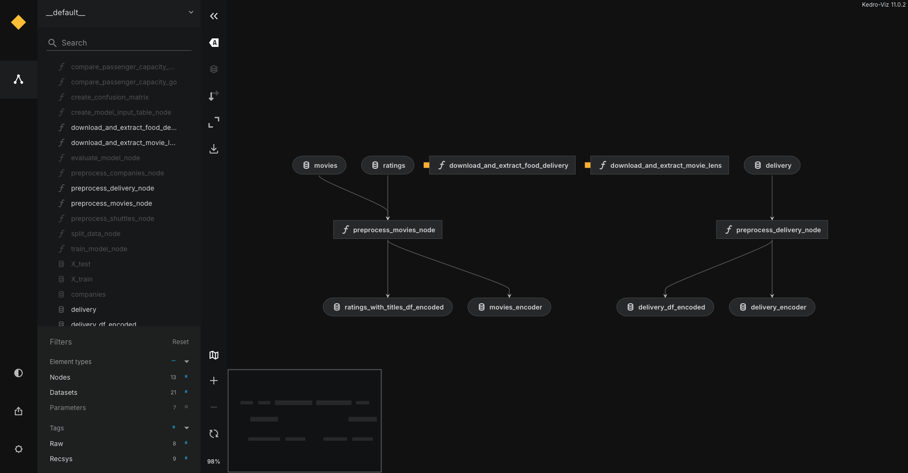

# Rec Sys

[](https://github.com/astral-sh/uv)
[](https://github.com/astral-sh/ruff)
[](https://kedro.org)

Hands on Recommender Systems

## Run kedro

First generate raw data:

```shell
kedro run --tags raw
```

Then run:

```shell
kedro run --tags recsys
```

To see the pipelines implemented, run:

```shell
kedro viz
```

and select only `Raw` and `Recsys` tags. You should see:



The rest of the pipelines implemented are examples.

## Technical Documentation

In order to showcase a project with a high technical level, the following tools have been included:

- [uv](https://docs.astral.sh/uv/): For an advanced python project management.
- [pre-commit](https://pre-commit.com): Pre-commit hooks automatically run checks (like formatting, linting, or simple tests) on code *before* a commit is finalized, acting as a crucial first line of defense to prevent low-quality or inconsistent code from entering the version control system.
- GitHub Actions: To perform automated tests and checks before any pull request is merged. It will also be usefull for CI/CD processes when the project is deployed in any cloud provider.
- [Kedro](https://docs.kedro.org/en/stable/introduction/index.html):  An open-source Python framework to create reproducible, maintainable, and modular data science code. It uses software engineering best practices to help you build production-ready data science pipelines.
- Formatting and linting with [Ruff](https://docs.astral.sh/ruff/tutorial/#getting-started): An extremely fast Python linter and code formatter, written in Rust. Formatting and linting improve code quality by ensuring consistent style and identifying potential errors or problematic patterns, making the code more readable, maintainable, and less prone to bugs.
- [Logging](https://docs.kedro.org/en/stable/logging/index.html): Kedro uses [Python’s logging library](https://docs.python.org/3/library/logging.html). Configuration is provided as a dictionary according to the [Python logging configuration schema](https://docs.python.org/3/library/logging.config.html#logging-config-dictschema) in Kedro’s default logging configuration `conf/logging.yml`
- TODO:
  - Implement [Testing](https://docs.kedro.org/en/stable/development/automated_testing.html#set-up-automated-testing-with-pytest)
  - Integrate with [Great Expectations](https://docs.kedro.org/en/stable/hooks/index.html#hooks)
  - Integrate with [MLflow](https://docs.kedro.org/en/stable/integrations/mlflow.html)
  - Integrate with [DVC](https://docs.kedro.org/en/stable/integrations/kedro_dvc_versioning.html)
  - Implement [Advanced deployment](https://docs.kedro.org/en/stable/deployment/index.html)

### Rules and guidelines

In order to get the best out of the template:

* Make sure your results can be reproduced by following a [data engineering convention](https://docs.kedro.org/en/stable/faq/faq.html#what-is-data-engineering-convention)
* Don't commit data to your repository
* Don't commit any credentials or your local configuration to your repository. Keep all your credentials and local configuration in `conf/local/`

### uv

All the project is managed through [uv](https://docs.astral.sh/uv/).

Here is a simple quickstart guide:

1. Install `uv`:

```shell
brew install uv
```

2. Sync this new environment with the dependencies specified in `pyprojec.toml`:

```shell
uv sync
```

> [!NOTE]
> Syncing the environment manually is especially useful for ensuring your editor has the correct versions of dependencies.

It instantly creates a new virtual  with all dependencies installed and located at `.venv` folder
which can be activated with the command:

```shell
source .venv/bin/activate
```

To deactivate the virtual environment just run:

```shell
deactivate
```

#### [The lockfile](https://docs.astral.sh/uv/concepts/projects/layout/#the-lockfile)

`uv` creates a `uv.lock` file next to the `pyproject.toml`.

`uv.lock` is a universal or cross-platform lockfile that captures the packages that would be
installed across all possible Python markers such as operating system, architecture, and Python version.

Unlike the `pyproject.toml`, which is used to specify the broad requirements of your project,
the lockfile contains the exact resolved versions that are installed in the project environment.
This file should be checked into version control, allowing for consistent and reproducible installations across machines.

A lockfile ensures that developers working on the project are using a consistent set of package versions.
Additionally, it ensures when deploying the project as an application that the exact set of used package versions is known.

The lockfile is automatically created and updated during `uv` invocations that use the project environment, i.e., `uv sync` and `uv run`.
The lockfile may also be explicitly updated using `uv lock`.

`uv.lock` is a human-readable TOML file but is managed by uv and should not be edited manually.
The `uv.lock` format is specific to `uv` and not usable by other tools.

#### `pip`

Python's package manager `pip` was replaced by an optimized tool inside UV, but its interface was kept without changes, just use `uv pip` instead of `pip`. For example, to list installed packages:

```shell
uv pip list
```

#### [Managing dependencies](https://docs.astral.sh/uv/concepts/projects/dependencies/#managing-dependencies)

Regarding to adding packages as dependencies (which also imply to include them in the virtual environment):

> [!CAUTION]
>
> Don't do it manually using `uv pip install`

Instead, do it using:

```shell
uv add package
```

#### [Running commands in projects](https://docs.astral.sh/uv/concepts/projects/run/#running-commands-in-projects)

Use `uv run` to run commands in the project environment:

```shell
$ # Presuming the project provides `example-cli`
$ uv run example-cli
```

To check which commands are provided in the project, check out `[project.scripts]` section of `pyproject.toml` file.
Learn more: [Command-line interfaces](https://docs.astral.sh/uv/concepts/projects/config/#command-line-interfaces)

### [pre-commit](https://pre-commit.com)

For standardization purposes, we use `pre-commit` on the project.

It was included as a dependency in the *development* group (check out `pyproject.toml` file):

```
[dependency-groups]
dev = [
    "pre-commit==4.2.0",
]
```

It is synced by default in the current environment, however it is not installed in the project as a
git hook yet. To install it, run:

```shell
pre-commit install
```

From now on, any new commited file is going to be checked by `pre-commit`.

If you want to run a check over all files:

```shell
pre-commit run --all-files
```

The configuration of `pre-commit` is defined in the file `.pre-commit-config.yaml`. You can add entries for the hooks you want to run before each `commit`.


### Kedro

#### How to run the Kedro pipeline

You can run the Kedro project with:

```shell
kedro run
```

#### How to test the Kedro project

Have a look at the files `src/tests/test_run.py` and `src/tests/pipelines/data_science/test_pipeline.py` for instructions on how to write the tests. Run the tests as follows:

```shell
pytest
```

To configure the coverage threshold, look at the `.coveragerc` file.


#### [How to work with Kedro and notebooks](https://docs.kedro.org/en/stable/notebooks_and_ipython/kedro_and_notebooks.html)

> Note: Using `kedro jupyter` or `kedro ipython` to run your notebook provides these variables in scope: `catalog`, `context`, `pipelines` and `session`.
>
> Jupyter, JupyterLab, and IPython are already included in the project requirements by default, so once you have run `uv sync` you will not need to take any extra steps before you use them.

##### Jupyter

You can start a local notebook server:

```shell
kedro jupyter notebook
```

##### JupyterLab

You can start JupyterLab:

```shell
kedro jupyter lab
```

##### IPython

If you want to run an IPython session:

```shell
kedro ipython
```

### [Code formatting and linting](https://docs.kedro.org/en/stable/development/linting.html)

`Ruff` has been included in both **GitHub Actions** (see: [ruff-action](https://github.com/astral-sh/ruff-action)) and `pre-commit` (see: [ruff-pre-commit](https://github.com/astral-sh/ruff-pre-commit))

It was also included in the *development* dependencies, so you can make use of the following commands to format and lint your code:

```shell
ruff format path/to/project/root
ruff check path/to/project/root
```

### Logging

To add logging to the code (e.g. in a node):

```python
import logging

logger = logging.getLogger(__name__)
logger.warning("Issue warning")
logger.info("Send information")
logger.debug("Useful information for debugging")
```

You can use Rich’s console markup in your logging calls:

```python
logger.error("[bold red blink]Important error message![/]", extra={"markup": True})
```

>[!TIP]
>
> More info: [Kedro logging](https://docs.kedro.org/en/stable/logging/index.html)
